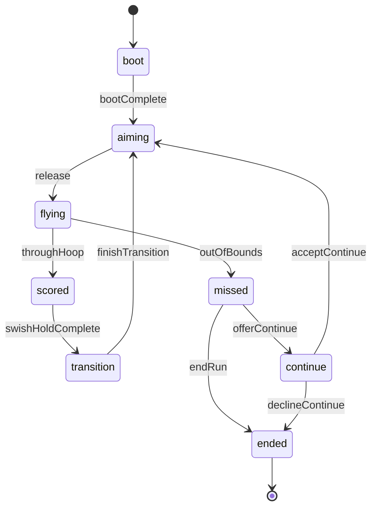

# @trickshot/logic

Pure TypeScript gameplay logic for Trick Shot — no Phaser dependency.

**Package choice:** `@trickshot/logic` lives in `packages/logic` (not `packages/shared/src/logic/`) so run FSM, future shot validators, and replay reducers can grow without bloating shared constants/types.

## Run FSM (Alpha)

Authoritative run lifecycle: aim → fly → score/miss → transition/continue.

**Tournament gate:** `offerContinue` is rejected when `mode === "tournament"` (`TOURNAMENT_ALLOWS_CONTINUES === false`). Miss flow must use `endRun` → `ended`.

### API

- `createRunFSM(mode)` / `RunFSM` — initial state
- `reduceRunFSM(ctx, event, nowMs?)` — pure reducer; returns `{ state, intents, accepted }`
- `snapshotRunFSM` / `restoreRunFSM` — serializable replay snapshot
- `PhysicsIntent` — side-effect hints for the scene integrator (start flight, dunk transition, etc.)

### Events

| Event | From → To |
|-------|-----------|
| `bootComplete` | boot → aiming |
| `release` | aiming → flying (rejected if below `minSpeed`) |
| `throughHoop` | flying → scored |
| `outOfBounds` | flying → missed |
| `swishHoldComplete` | scored → transition |
| `finishTransition` | transition → aiming |
| `offerContinue` | missed → continue (casual/daily only) |
| `endRun` | missed → ended |
| `acceptContinue` | continue → aiming |
| `declineContinue` | continue → ended |
