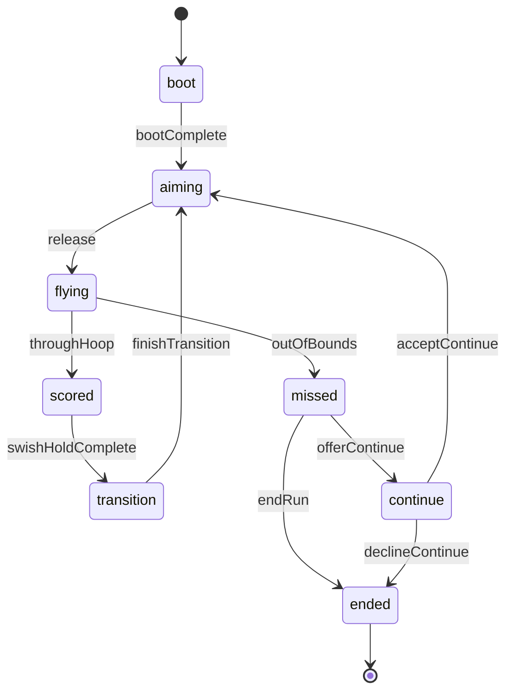

# @trickshot/logic

Pure TypeScript gameplay logic for Trick Shot — no Phaser dependency.

**Package choice:** `@trickshot/logic` lives in `packages/logic` (not `packages/shared/src/logic/`) so run FSM, future shot validators, and replay reducers can grow without bloating shared constants/types.

## Mode rules matrix

Per-mode policy lives in `@trickshot/shared` (`getModeRules`). Logic consumes it for FSM, powerups, seeds, and replay — **do not** add scattered `mode === "tournament"` checks.

| Rule | casual | daily | tournament |
|------|--------|-------|------------|
| Continues | ✅ | ✅ | ❌ |
| Powerups | ✅ | ✅ | ❌ |
| Seed | `resolveRunSeed` → per-run uuid | UTC date | tournament id |
| Stars | ✅ | ✅ | ✅ |

See [`packages/shared/README.md`](../shared/README.md) for the full matrix and `assertCanContinue` / `assertCanUsePowerup` helpers.

## Run FSM (Alpha)

Authoritative run lifecycle: aim → fly → score/miss → transition/continue.

**Tournament gate:** `offerContinue` is rejected when `getModeRules(mode).allowsContinues === false`. Miss flow must use `endRun` → `ended`.

### API

- `createRunFSM(mode)` / `RunFSM` — initial state
- `reduceRunFSM(ctx, event, nowMs?)` — pure reducer; returns `{ state, intents, accepted }`
- `snapshotRunFSM` / `restoreRunFSM` — serializable replay snapshot
- `PhysicsIntent` — side-effect hints for the scene integrator (start flight, dunk transition, etc.)

### Events

| Event | From → To |
|-------|-----------|
| `bootComplete` | boot → aiming |
| `release` | aiming → flying (rejected if below `minSpeed`) |
| `throughHoop` | flying → scored |
| `outOfBounds` | flying → missed |
| `swishHoldComplete` | scored → transition |
| `finishTransition` | transition → aiming |
| `offerContinue` | missed → continue (casual/daily only) |
| `endRun` | missed → ended |
| `acceptContinue` | continue → aiming |
| `declineContinue` | continue → ended |

## Shot layout & spawn (Alpha)

Deterministic zigzag hoop placement and one-obstacle spawn rules (no Phaser).

### API

- `createRng(seed)` / `dailySeedFromUtcDate(date?)` — seeded streams for casual & daily
- `resolveRunSeed(mode, { runSeed, utcDate?, tournamentId? })` — mode-matrix seed resolution
- `layoutForSide(side, score, width, height)` — source/goal/star poses
- `generateShotLayout({ side, score, seed, mode, width, height })` — full shot (0 or 1 obstacle)
- `buildObstacles(..., rng)` — low-level spawn when replay already has poses
- `nextSide(side)` — zigzag alternation helper

### Coordinate assumptions

Layouts use logical court pixels (Alpha default **390×780** portrait). Source sits low on `side` (x ≈ 22% or 78%), goal high on the opposite rail (y ≈ 29%). Camera scroll and Phaser draw stay in `apps/web`.

### Obstacle probabilities

| Score | Obstacles | Wall weight | Notes |
|-------|-----------|-------------|-------|
| 0 | 0 | — | Tutorial clean lane |
| 1–3 | 1 | 50% | Wall peg or bumper disc |
| ≥ 4 | 1 | 65% | “Hard”: taller peg (100px), larger bumper (r=24), wider offset |

Per-shot RNG: `shotRng(mode, seed, score, side)` — same inputs → identical layout in Node and browser.

## Scoring & combo (Alpha)

Pitch-aligned dunk points, combo multipliers, and star economy — pure reducers for Sub D juice.

### API

- `createScoreState()` / `reduceScoreEvent(state, event)` — dunk / miss / star / continue
- `comboLabel(chainLength)` → `null | "x2" | "x3" | "ON FIRE"`
- `comboMultiplier` / `dunkPoints` — point math
- `shouldSpawnStar(fromScore, rngUnit)` — pitch `starOn` (90% or score &lt; 2)
- `buildRunSummary({ mode, scoreState, ... })` — maps to `@trickshot/shared` `RunSummary`
- `applyWideHoop` / `applySlowDrop` — powerup stubs; gated by `getModeRules(mode).allowsPowerups`
- `assertPowerupAllowed(mode, sku)` — shop confirm path; throws `ModePolicyError` in tournament

### Combo policy

| Event | Chain | Points / stars |
|-------|-------|----------------|
| `dunk` | +1 | +`dunkPoints(chain)`; auto-star if `starActive` |
| `miss` | reset 0 | preserved |
| `acceptContinue` | reset 0 | preserved |
| `collectStar` | — | +`STAR_POINTS`, +1 star |

Thresholds: x2 @ 2, x3 @ 3, ON FIRE @ 4+ (multiplier caps at ×4).

## Input log & hybrid replay (#23)

Client recorder + server validator for `anticheat=hybrid`. Schema lives in `@trickshot/shared`; recorder/replay in `@trickshot/logic`.

### Seeded RNG contract

All layout randomness is derived — **no obstacle rolls stored in the log**:

| Concern | Function | Key |
|---------|----------|-----|
| Obstacles / poses | `shotRng(seed, score, side, mode)` | `${mode}:${seed}:${score}:${side}` |
| Star spawn | `shotRng(...).next()` → `prepareShot` | same stream, first draw |

Same `seed` + score progression + side → identical layouts, obstacles, and star flags in browser and Node.

### API

- `createInputLogRecorder({ seed, mode, physicsBuildId })` — append-only client recorder
- `replayRunFromInputLog(raw, { expectedPhysicsBuildId? })` — Node replay reducer
- `validateInputLog` / `parseInputLog` — Zod schema in `@trickshot/shared`
- `PHYSICS_BUILD_ID` — from `@trickshot/physics`; embedded in every log

### Truncation policy

- Max **4096** frames, **512 KiB** serialized JSON (`INPUT_LOG_MAX_*` in shared).
- Recorder stops appending when limits hit; sets `truncated: true` on finalize.
- Tournament logs must not contain `continue_accept` when `getModeRules(mode).allowsContinues === false`.

### RunSummary

`buildRunSummary({ ..., inputLog: recorder.finalize() })` — no client-declared score inside the log.
