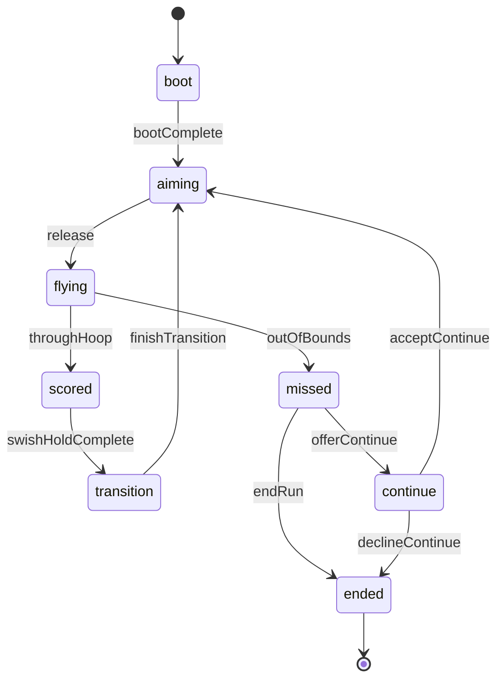

# @trickshot/logic

Pure TypeScript gameplay logic for Trick Shot — no Phaser dependency.

**Package choice:** `@trickshot/logic` lives in `packages/logic` (not `packages/shared/src/logic/`) so run FSM, future shot validators, and replay reducers can grow without bloating shared constants/types.

## Run FSM (Alpha)

Authoritative run lifecycle: aim → fly → score/miss → transition/continue.

**Tournament gate:** `offerContinue` is rejected when `mode === "tournament"` (`TOURNAMENT_ALLOWS_CONTINUES === false`). Miss flow must use `endRun` → `ended`.

### API

- `createRunFSM(mode)` / `RunFSM` — initial state
- `reduceRunFSM(ctx, event, nowMs?)` — pure reducer; returns `{ state, intents, accepted }`
- `snapshotRunFSM` / `restoreRunFSM` — serializable replay snapshot
- `PhysicsIntent` — side-effect hints for the scene integrator (start flight, dunk transition, etc.)

### Events

| Event | From → To |
|-------|-----------|
| `bootComplete` | boot → aiming |
| `release` | aiming → flying (rejected if below `minSpeed`) |
| `throughHoop` | flying → scored |
| `outOfBounds` | flying → missed |
| `swishHoldComplete` | scored → transition |
| `finishTransition` | transition → aiming |
| `offerContinue` | missed → continue (casual/daily only) |
| `endRun` | missed → ended |
| `acceptContinue` | continue → aiming |
| `declineContinue` | continue → ended |

## Shot layout & spawn (Alpha)

Deterministic zigzag hoop placement and one-obstacle spawn rules (no Phaser).

### API

- `createRng(seed)` / `dailySeedFromUtcDate(date?)` — seeded streams for casual & daily
- `layoutForSide(side, score, width, height)` — source/goal/star poses
- `generateShotLayout({ side, score, seed, mode, width, height })` — full shot (0 or 1 obstacle)
- `buildObstacles(..., rng)` — low-level spawn when replay already has poses
- `nextSide(side)` — zigzag alternation helper

### Coordinate assumptions

Layouts use logical court pixels (Alpha default **390×780** portrait). Source sits low on `side` (x ≈ 22% or 78%), goal high on the opposite rail (y ≈ 29%). Camera scroll and Phaser draw stay in `apps/web`.

### Obstacle probabilities

| Score | Obstacles | Wall weight | Notes |
|-------|-----------|-------------|-------|
| 0 | 0 | — | Tutorial clean lane |
| 1–3 | 1 | 50% | Wall peg or bumper disc |
| ≥ 4 | 1 | 65% | “Hard”: taller peg (100px), larger bumper (r=24), wider offset |

Per-shot RNG: `shotRng(mode, seed, score, side)` — same inputs → identical layout in Node and browser.
